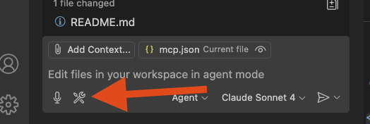
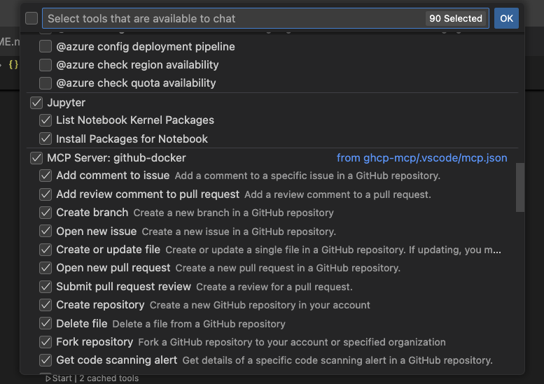
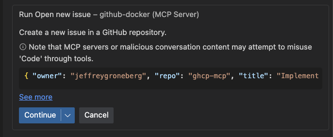
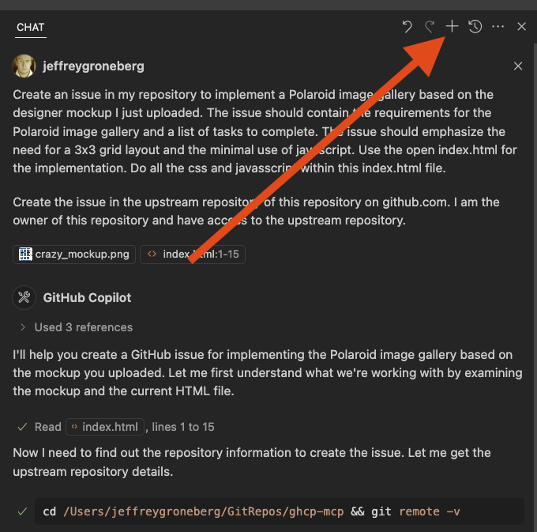
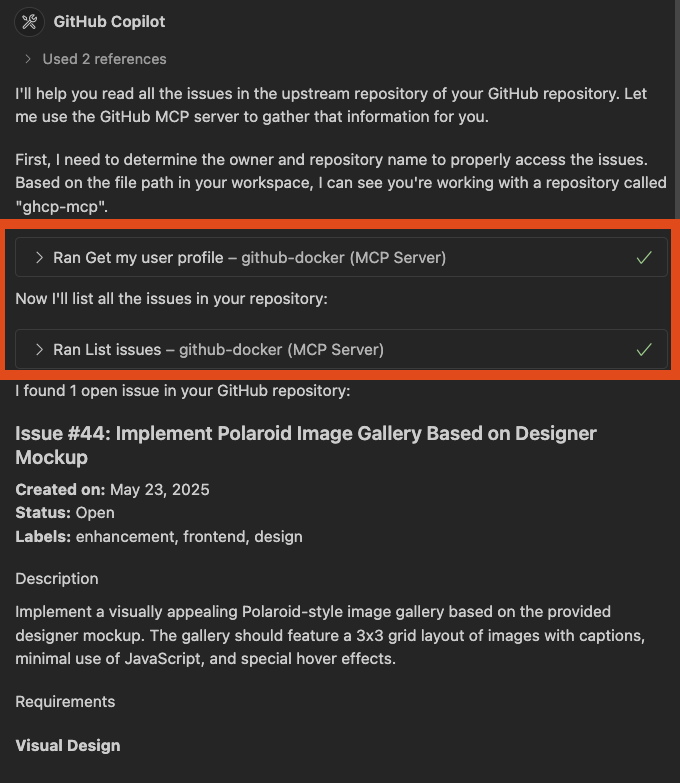
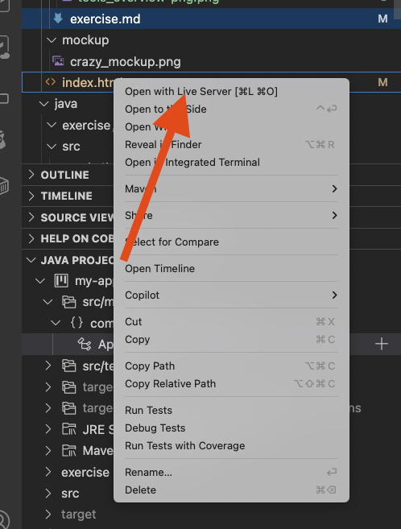

# Overview

Happy you find your way to this exercise. In this exercise we will create a Polaroid image gallery using the new GitHub Copilot agent mode in conjunction with the GitHub Copilot MCP server and the Playwright MCP server.

## Good to know

This exercise is a successor of the Polaroid image gallery exercise we use for our fundamentals course. You find that exercise [here](https://efesenerr.github.io/github-copilot-hands-on-labs/hands-on/html-gallery/). It does make sense to let your participants do the fundamentals course first and then this exercise to also show how much more powerful the GitHub Copilot agent mode is.

## Non-Deterministic

> [!NOTE]

> **Even though you are using the same prompt, the agent might generate different code each time. This is normal and 
> expected!**
> 
> It is NOT possible to write a deterministic training and exercise for GitHub Copilot and the experience will be different for each participant. YOu need to deal with this. Safeguarding your code is a necessity and you should always use version control and automated testing to keep track of your changes when using GitHub Copilot. 

# Prerequisites

You need to either have this repository cloned to your local machine or have it open in a GitHub Codespace. You also need to have the GitHub Copilot extension installed and configured in your IDE. If you are using a local machine, make sure you have the MCP server running as well - we will do this in the next steps. 

## MCP Servers 

Before we start, you need to make sure that the MCP servers are running. You can do this by clicking on `start` when opening the `.vscode/mcp.json` file. This will start the MCP servers! Always make sure that you need to start the right GitHub MCP server based on how you have started this exercise - either on your local machine or in a GitHub Codespace.


When starting the GitHub MCP server, you will be prompted to enter your GitHub Personal Access Token (PAT). This is required to authenticate with the GitHub API and allows the MCP server to access your repositories and other information. You can create a PAT by following the instructions in the [GitHub documentation](https://docs.github.com/en/authentication/keeping-your-account-and-data-secure/managing-your-personal-access-tokens?wt.mc_id=DT-MVP-5004771). 

### Check your MCP servers running

Switch over to the GitHub Copilot Chat and check within the input panel the `tools button`. 



After clicking on the tools button, you should see the following:



**Enable all tools your GitHub MCP server and the Playwright MCP server**

# Step 1: Creating an issue in your repository to implement the Polaroid image gallery

We will leverage the GitHub Copilot MCP server to create an issue in your repository. This issue will contain the requirements for the Polaroid image gallery based on the designer mockup. 

Switch over to the GitHub Copilot Chat and drag the `crazy_mockup.png` file into the input panel. This will upload the image to the chat and allow the agent to analyze it. Be sure to use `Claude 3.7 Sonnet` or another reasoning model for this task (that is capable of dealing with images) A reasoning model is recommended to analyze the image and create an issue with the requirements.

Use the following prompt to create the issue. Open the basic `index.html` file in an active tab:

```
Create an issue in my repository to implement a Polaroid image gallery based on the designer mockup I just uploaded. The issue should contain the requirements for the Polaroid image gallery and a list of tasks to complete. The issue should emphasize the need for a 3x3 grid layout and the minimal use of javascript.

Create the issue in the upstream repository of this repository on github.com. I am the owner of this repository and have access to the upstream repository.
```

When the agent is running, there **will* come additional questions or clarifications. This is normal and expected. The agent will ask you to clarify the requirements and it will also ask you to press a button. Do that. 

Whenever the agent likes to leverage a MCP server to progress, it will ask you to press a button. This is normal and expected. 

Here is an example of how this looks like:


When the agent is done, you should see an issue created in your repository. 

**Follow the link to the issue and check if the requirements are correct. If not, you can always ask the agent to update the issue!**

Congratulations! You have successfully created an issue in your repository using the GitHub Copilot MCP server and the agent mode. Now we will use the GitHub Copilot MCP server to create the Polaroid image gallery based on the requirements in the issue we just created.

# Step 2: Create the Polaroid image gallery

Switch over to the GitHub Copilot Chat. For the sake of the demo we will create a new session. Press the `+` button in the top right corner of the chat window to create a new session. This will allow you to start a new conversation with the agent, but keep the previous conversation intact.



## Reading all issues in the repository

In order to create the Polaroid image gallery, we need to read the issue we just created. We can do this by using the GitHub Copilot MCP server to read all issues in the repository. Use the following prompt to read all issues in the repository:

```
Read all issues in the upstream repository of this repository on github.com. I am the owner of this repository and have access to the upstream repository. 
```

The agent will leverage the GitHub Copilot MCP server to read all issues in the repository. This will allow the agent to access the issue we just created and use it as a reference for creating the Polaroid image gallery.

A result should look like this:



## Let the agent create the Polaroid image gallery for us

Now we can let the agent create the Polaroid image gallery for us. Be sure to select `Claude Sonnet 4` for this task.
Use the following prompt to create the Polaroid image gallery - ** adjust the prompt to target your own issue number**:

```
Take issue #44 and implement it based on the requirements and infos in this issue. Try to be minimalistic and use as less javascript as possible. Keep the HTML and CSS as clean as possible and within the index.html file.
```

It will take some time for the agent to create the gallery. When the agent is done, you should see the Polaroid image gallery created in your repository. You need to press the `keep` button to keep the code.

Right click the `index.html` file and open it with `Live Server`: 



Look at the Polaroid image gallery in your browser. We might fix some bugs now. 

### Fixing Rick Roll sound bug

The Rick Roll sound might not work when clicking on an image please use the following prompt to fix this issue:

```
Fix the Rick Roll sound bug in the Polaroid image gallery. The sound should play when clicking on an image. https://media.memesoundeffects.com/2023/03/Rick-Roll-Sound-djlunatique.com_.mp3 as a src for the audio.
```

### Fix the nyan cat bug

The Nyan Cat might now fly in the Polaroid image gallery. Please use the following prompt to fix this issue:

```
There is no nyan cat flying in the Polaroid image gallery. Please fix this issue and make the nyan cat fly in the Polaroid image gallery in the footer from left to right. Use the following image as a src: https://media.tenor.com/E3MLgDP1qoQAAAAi/nyan-cat-transparent.gif 
```

### Fixing other bugs

Interact with the agent and ask it to fix other bugs. You can also ask the agent to improve the code and make it more readable. Give the agent clear instructions and it will do its best to help you. You can also reference old tasks and refine them by giving the agent clear feedback. 

** Use a new session if you have the feeling your prompts are leading to nowhere. This is normal and expected. The agent will sometimes get stuck in a loop and you need to start a new session to get it back on track. **

## Step 3: Create tests for the Polaroid image gallery

> [!NOTE]

> This step is only working if you are running the exercise on your local machine! 


Now we will use the Playwright MCP server to create tests for the Polaroid image gallery. The Playwright MCP server allows us to generate tests for our application and run them in different browsers.

We would like to create a simple test that checks if the rick roll sound is playing when clicking on an image. We will use the Playwright MCP server to create this test.
Switch over to the GitHub Copilot Chat and create a new session. Use the following prompt to create the tests:

```
Use Playwright to open the browser at http://127.0.0.1:5500/html/index.html and click on an image. Concentrate solely on that task and nothing else.
```

The agent will create a test for you that opens the browser and clicks on an image.

Afterwards use the following prompt to create a test that checks if the rick roll sound is playing when clicking on an image:

```
Can you create an automated test out of this? 
```

That one is complex and might take some time. The agent will create a test for you that checks if the rick roll sound is playing when clicking on an image. If the test is NOT working, then still move on the next step. The agent is still getting improved and this is a complex task. 

## Step 4: Close the issue

Now we can close the issue we created in the first step. Use the following prompt to close the issue:

```
Close the issue #44 in the upstream repository of this repository on github.com. I am the owner of this repository and have access to the upstream repository. 
```

Confirm the update and the issue will be closed. Check the issue in your repository and make sure it is closed.
